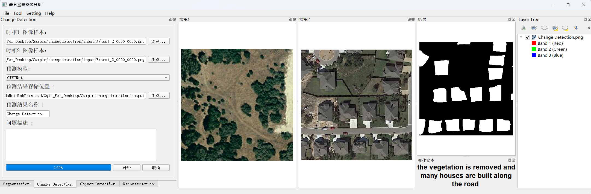

# 变化检测

## 概述

> 变化检测功能位于 **Change Detection** 标签页，可以检测并分析遥感图像中的地物变化。

## 操作步骤

1. **选择对比图像**
   - 需要选择两个不同时相的遥感图像样本
   - 分别代表变化前后的地表情况

2. **图像分析**
   - 系统将使用 [**CTMTNet**](https://ieeexplore.ieee.org/document/10740028) 模型进行变化检测
   - 支持多种结果展示方式，便于直观理解地物变化情况
      - 突出显示新增物体的图像
      - 相应的变化说明文字

<!-- tabs:start -->

#### **图像结果**

#### **文字结果**

<!-- tabs:end -->

?> **技术说明**：[**CTMTNet**](https://ieeexplore.ieee.org/document/10740028) 是一个基于 CNN-Transformer 的多任务网络模型，不仅能检测遥感图像中的变化，还能自动生成变化描述文本。

!> 请确保输入的两幅遥感图像覆盖相同的地理区域。