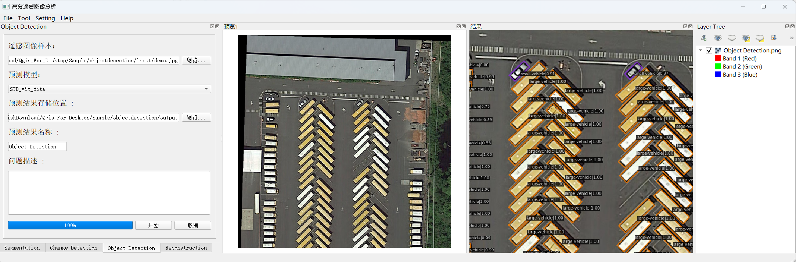
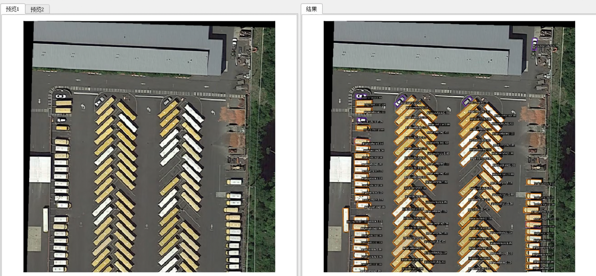

# 物体检测

## 概述

> 物体检测功能位于 **Object Detection** 标签页，可以识别图片中有什么类型的物体及其所在位置，给出每个物体的外接矩形框。

## 操作步骤

1. **选择图像样本**
   - 点击界面上的第一个"浏览..."按钮
   - 选择需要处理的遥感图像样本

2. **图像处理**
   - 系统将使用 [STD ViTs](https://github.com/yuhongtian17/Spatial-Transform-Decoupling) 模型对输入图像进行自动处理
   - 处理完成后将显示检测结果

?> **技术说明**：
[STD ViTs](https://github.com/yuhongtian17/Spatial-Transform-Decoupling) 是一种基于 Vision Transformers (ViTs) ，利用空间变换解耦（Spatial Transform Decoupling, STD）方法的物体检测模型，在旋转敏感场景表现优异。