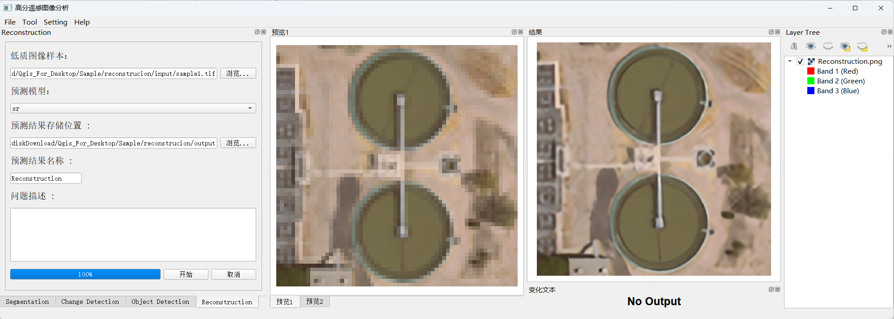
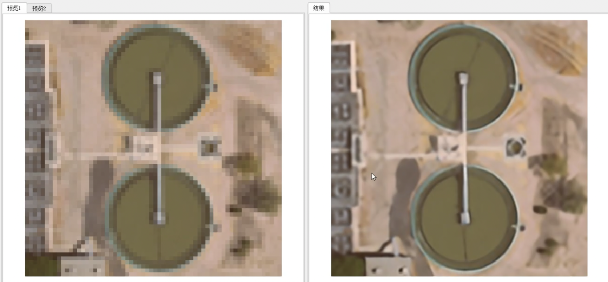

# 超分辨率重建

## 概述
> 超分辨率重建功能位于 **Reconstruction** 标签页，可以基于成像物理机理对低分辨率图像进行复原，提高图像分辨率。

## 操作步骤

1. **选择图像样本**
   - 点击界面上的第一个"浏览..."按钮
   - 选择需要处理的低分辨率图像样本

2. **图像重建**
   - 系统将使用超分辨率重建算法对输入图像进行处理
   - 处理完成后将显示高分辨率重建结果

