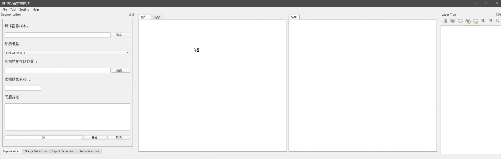
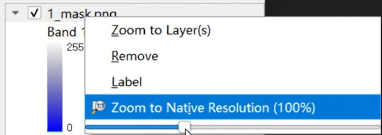

# 语义分割

## 概述

> 程序主界面位于 **Segmentation** 标签页，主要功能是利用遥感图像进行语义分割（地物提取）。

## 操作步骤

1. **选择图像样本**
   - 点击界面上的第一个"浏览..."按钮
   - 选择需要解释的遥感图像样本

2. **图像处理**
   - 系统将使用 [**AerialFormer**](https://github.com/UARK-AICV/AerialFormer) 模型对输入图像进行预测处理。
   - 不同地物会以不同的颜色进行标注，生成语义分割结果。

?> **技术说明**：[**AerialFormer**](https://github.com/UARK-AICV/AerialFormer) 是一种多分辨率 Transformer 模型，专为航空遥感图像分割任务设计，能够高效提取图像中的地物信息。

3. **图层叠加**
   - 界面右侧的 **Layer Tree** 栏，可以调节灰度遮罩图层的像素值（范围：0-255），以优化图像的视觉效果并突出目标物体。
   - 输出的图像可以叠加其他图层，例如原图或预测标签图，便于对比和分析。

!> 其他功能页面同样可以实现图层叠加功能，不再赘述。